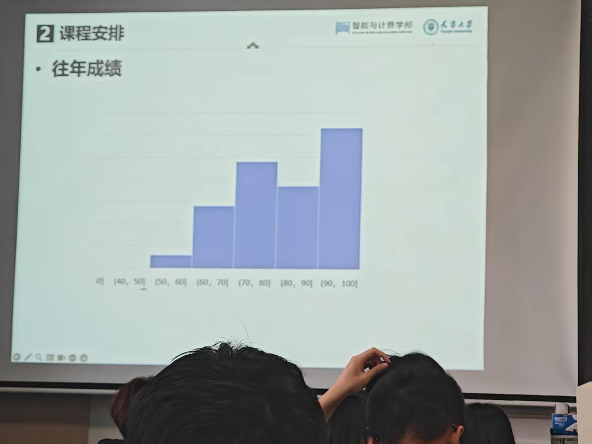

# 大数据分析理论与方法

## 25261学期  王晓飞(教授),仇超(副教授)

### 简介

主要讲大数据，数据挖掘相关。比如啤酒和尿布一类的。以及一些算法，比如hadoop，spark，关联规则挖掘等等。

### 平时

无签到

有两个小作业

第一个是写一篇作文：我认为的___赋能大数据

第二个是xxxxx行业大数据相关调查报告

### 大作业

4人组队，自己写代码，做实验，弄spark一类的大数据算法，然后写一个xxxx行业大数据科技报告。

作业要求里面说要写3000字，但实际上你写几万字分数也不会有变化，多少字都一样。

### 评价

纯水，分数只取决于总共3次作业，如果图省事可以选，但是分数不是很高。

必须要附上这张图片，这老师骗人有一手的。

学长学姐们已经在wby火力全开了，一开课用这张图骗同学们选，结果辛辛苦苦写那么多大作业，最后得一个这样的分数。

