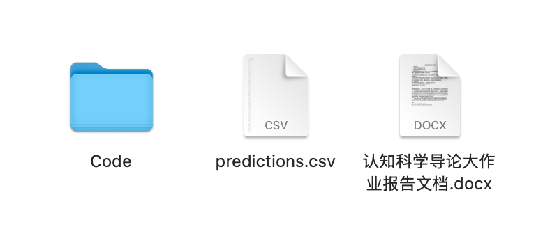

# 作业要求

结合已学的课程知识，利用机器学习方法，对给定的PVT范式诱发的脑电数据集进行疲劳检测算法设计及应用调研。要求三人一组，协作完成。

**作业提交内容：**

* 提交疲劳检测算法源代码和算法模型检测结果`predictions.csv`
* 基于PVT范式的疲劳检测方法应用场景调研，以报告形式提交，内含：
  * 应用场景调研
  * 疲劳检测算法设计
* 上述的配套讲解视频

**报告内容要求：**

1. 介绍运用的模型和模型架构，要求绘制整体模型架构图
2. 介绍训练方法（如训练集验证集的划分、使用哪种优化器等）
3. 介绍团队分工情况
4. 应用场景调研结果

**作业命名要求：**

* 提交一个名为`predictions.csv`的文件
* 代码放在文件放在`Code`文件夹下
* 报告文档命名为`认知科学导论大作业报告文档.docx`
* 配套讲解视频
* 上述四个文件放在同一级目录下，如下图所示：
  * 
* 将所有内容`{学生1学号}_{姓名}_{学生2学号}_{姓名}_{学生3学号}_{姓名}.zip`为名进行压缩。

**提交时间截止到6月24日23:59:59**

# 数据集简介

本项目使用的数据集为PVT范式数据集。

PVT 实验范式能够有效而频繁地诱发受试者做出反映其行为表  现的操作,而将这些行为表现转化为可量化、可分析的数值指标则是精神疲劳相关研究的基础和关键。基于对精神疲劳特征与行为表现关系的综合分析,本文选择以反应时间作为主要的行为表现指标,通过对其进行标准化的定义、计算和处理,为后续对精神疲劳状态进行的量化评估与标定提供客观、可靠的数据支撑。

本作业数据集将预处理好的数据给到同学们。经历了1～50hz带通滤波、重采样250hz，线噪抑制，全局平均重参考，ICA伪迹去除。

同时计算给出了每一个电极下，五个频段（'Delta': (0.5, 4), 'Theta': (4, 8), 'Alpha': (8, 13), 'Beta': (13, 30), 'Gamma': (30, 50)，单位Hz）的Power（功率）特征与DE（微分熵）特征

Power计算公式为：
$$
\frac{1}{N}*abs(x)^2
$$
x为信号值，N为数据点个数

微分熵DE特征，公式推导简化后为：
$$
\frac{1}{2}(2*\pi*σ^2)
$$
其中$σ^2$为这个样本数据的方差

# 目标

利用已学的机器学习（包括深度学习）知识，构建一个机器学习模型对给定的测试集进行分类。

原数据集为11名被试的的数据，其中一名被试数据将被当作测试数据集，在项目文件夹中的`test_data.pkl`来进行表示，剩下的10名被试当作训练集。

鼓励大家进行文献查询，尝试不同的方法。

提交一个名为`predictions.csv`的文件。

`predictions.csv`的格式和保存样式，由实验文件中的`res/sample_predictions.csv`所示。csv的保存代码已在`test.py`中给出。

> 说明文档内容要求：
>
> 1. 介绍运用的模型和模型架构，要求绘制整体模型架构图
> 2. 介绍训练方法（如训练集验证集的划分、使用哪种优化器等）
> 3. 介绍团队分工情况
> 4. 附加题调研结果
>
> 文档要对所用方法描述清楚，逻辑清晰。

同学们可以查阅文献，不限制使用的模型和方法，以提交的`predictions.csv`计算得到的`准确率`和`对应的说明文档`为评判标准，分别占比`6:4`。

## 准确率评分计算公式

$$
min(100, max(60, 60+40*(\frac{acc-0.45}{topline-0.45})^{\log(2.2)}))
$$

其中topline取0.75

***

> hint：
>
> * 被试间差异性过大，解决跨被试问题有什么好的思路？
> * LOSO（leave-one subject-out）交叉验证方法是什么？
